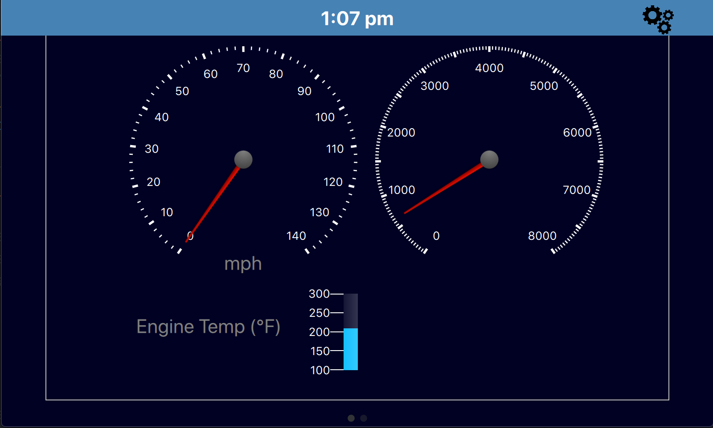

# Carberry Pi Documentation

// Logo

 Carberry Pi

```wow

         11111111
        11   11   1
     111     11    1111
    111111111111111111111111
    1111001111111111110011111
      100001        100001
        00              00            
```

## Outline of this Document

1. [Introduction](#introduction)

2. [Hardware](#hardware)

3. [Carberry Pi Software](#software)
   
   3.1 [Dashboard](#dashboard)
   
   3.2 [Diagnostics](#diagnostics)
   
   3.3 [Configuration](#configuration)
   
   3.4 [Displaying Engine Codes](#displaying-engine-codes)
   
   3.5 [Architecture](#architecture)

4. [Connecting the Pieces](#connecting-the-pieces)

5. [Getting Up and Running](#getting-up-and-running)

## Introduction

- *Carberry Pi* is an automotive application of a mini-computer in the car.  As the quintessential project for my undergraduate studies, this concept provides a deep-dive into an area of future interest.

## Hardware

Carberry Pi requires a few tools of the trade.

    Namely:

- Raspberry Pi (this project uses a Raspberry Pi 3 model B)

- Professional Grade OBDII Cable

- Raspberry Pi Touchscreen

- [DS3231 RTC IC]([https://thepihut.com/products/mini-rtc-module-for-raspberry-pi](https://thepihut.com/products/mini-rtc-module-for-raspberry-pi) (Real Time Clock)

## Carberry Pi Software

#### Dashboard



#### Diagnostics


#### Configuration


- Currently a work-in-progress

#### Architecture

##### Written in__

- Backend: Python
  
  - Utilizes python-obd library for OBD information

- Frontend: PyQt (Qt-Quick Focused) | Javascript

##### Interface Architecture

- Dynamic loading allows react-like module instantiation and destruction
  
  - Each component is loaded into a *view* as a separate entity
  
  - These components can then be pushed/popped onto or from the main*stackview*
  
  - A separate script (javascript) manages the creation/destruction of the *back* button

- Time
  
  - The time is based on the RTC (Real Time Clock) of the Raspberry Pi itself.
  
  - As such, changing the locality has no effect on the time value.

## Connecting the Pieces

// tutorial with picture layout of connecting each component

## Getting Up and Running

#### Recommended OS: DietPi

The *DietPi* (debian-based) operating system distribution acts as a lightweight desktop environment for running GUIs on the Pi. 

Of Course, you may run this application on another operating system of your choosing.


**Recommended DE: LXDE**

This project uses *LXDE* as it is a lightweight desktop environment that suits the limited hardware of the Rasperry Pi wonderfully.  


\*\* The *autostart* functionality of the installation script requires LXDE. 

\*\* The use of another desktop environment will require appending a command that executes the *start_carberry.sh* script to the startup file of the respective DE.


